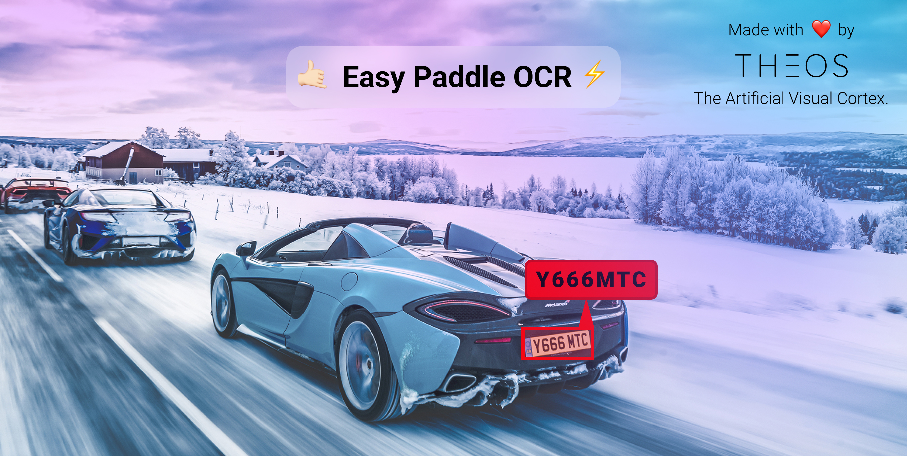
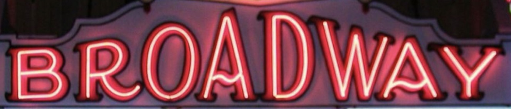
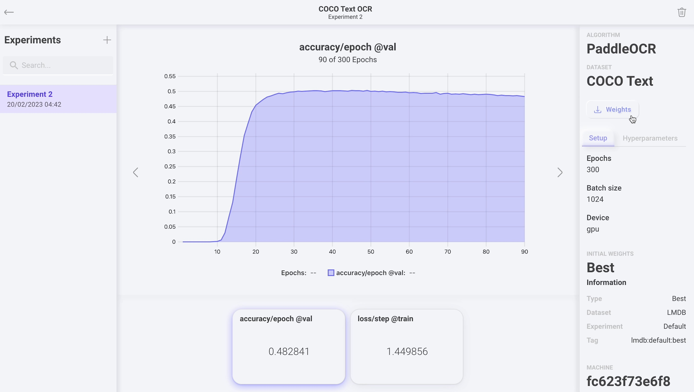
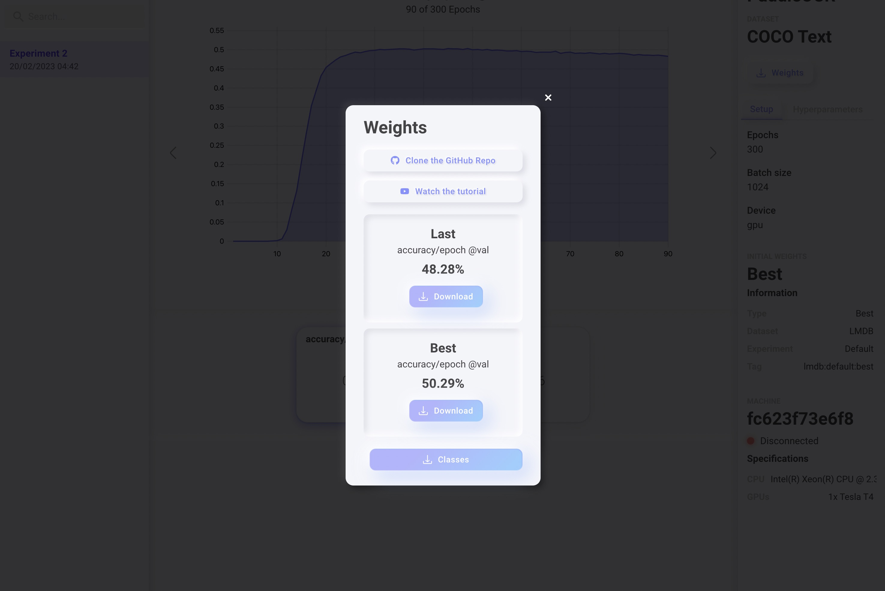

# 🤙🏻 Easy Paddle OCR ⚡️



This a clean and easy-to-use implementation of [Paddle OCR](https://github.com/PaddlePaddle/PaddleOCR). Made with ❤️ by [Theos AI](https://theos.ai).

Don't forget to subscribe to our [YouTube Channel](https://www.youtube.com/@theos-ai/)!

### Install all the dependencies

```
pip install -r requirements.txt
```

### How does it work?

The text recognition is made on a cropped part of a larger image, usually these crops are made with the bounding box output of an [Object Detection](https://docs.theos.ai/get-started/object-detection) model. You can learn how to build a license plate recogition model on the following [YouTube Tutorial](https://www.youtube.com/watch?v=GVLUVxTpqG0). You can easily train a model to make bounding boxes around any kind of text, not just license plates. After training your own object detection model, you can pass those cropped bounding boxes to Easy Paddle OCR in order to perform text recognition and read the text they contain.

### Read the text
On the **read.py** file we recognize the text of 3 different cropped bounding boxes, each taken from larger images.


*broadway.jpeg*


*brooklyn.jpeg*


*casino.jpeg*

Let's recognize all of them with the following command.

```
python read.py
```

You should now see the following output.

```
[+] image: broadway.jpeg
[+] text: BROADWAY
[+] confidence: 98%
[+] inference time: 39 milliseconds

[+] image: brooklyn.jpeg
[+] text: BROOKLYN
[+] confidence: 96%
[+] inference time: 31 milliseconds

[+] image: casino.jpeg
[+] text: CASINO
[+] confidence: 78%
[+] inference time: 30 milliseconds
```

## Custom Training

If you find that the default Paddle OCR weights don't work very well for your specific use case, we recommed you to train your own OCR model on [Theos AI](https://theos.ai).

A tutorial on how to do this is coming soon, but if you already signed up and figured out how to build your own dataset on Theos and trained it on Paddle OCR, the only thing you have to do now is download your custom weights from your training session experiment by clicking the weights button on the top right corner.





Download the **Last** or **Best** weights and extract the zip file, finally copy the following files into the weights folder of this repository.

```
dictionary.txt
inference.pdiparams
inference.pdiparams.info
inference.pdmodel
```

## Contact us

Reach out to [contact@theos.ai](mailto:contact@theos.ai) if you have any questions!