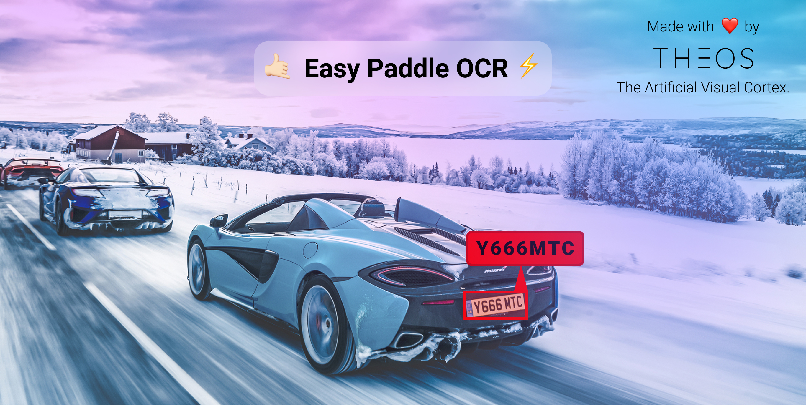
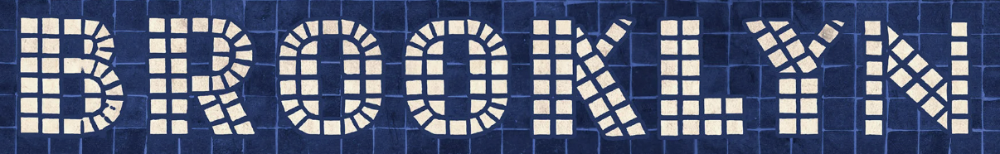
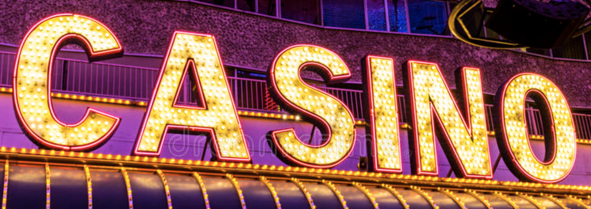

# 🤙🏻 Easy Paddle OCR ⚡️



This a clean and easy-to-use implementation of [Paddle OCR](https://github.com/WongKinYiu/yolov7). Made with ❤️ by [Theos AI](https://theos.ai).

Don't forget to subscribe to our [YouTube Channel](https://www.youtube.com/@theos-ai/)!

### Install all the dependencies

```
pip install -r requirements.txt
```

### How does it work?

The text recognition is made on cropped part of a larger image, usually these crops are made with the bounding box output of an [Object Detection](https://docs.theos.ai/get-started/object-detection) model. You can learn how to build a license plate recogition model on the following [YouTube Tutorial](https://www.youtube.com/watch?v=GVLUVxTpqG0). After training your own object detection model, you can pass those cropped bounding boxes to Easy Paddle OCR to perform text recognition.

### Read the text
On the **read.py** file we recognize the text of 3 different cropped bounding boxes, each taken from larger images.


*broadway.png*


*brooklyn.png*


*casino.png*

Let's recognize all of them with the following command.

```
python read.py
```

You should now see the following output.

```
[+] image: broadway.jpeg
[+] text: BROADWAY
[+] confidence: 98%
[+] inference time: 39 milliseconds

[+] image: brooklyn.jpeg
[+] text: BROOKLYN
[+] confidence: 96%
[+] inference time: 31 milliseconds

[+] image: casino.jpeg
[+] text: CASINO
[+] confidence: 78%
[+] inference time: 30 milliseconds
```

## Contact us

Reach out to [contact@theos.ai](mailto:contact@theos.ai) if you have any questions!